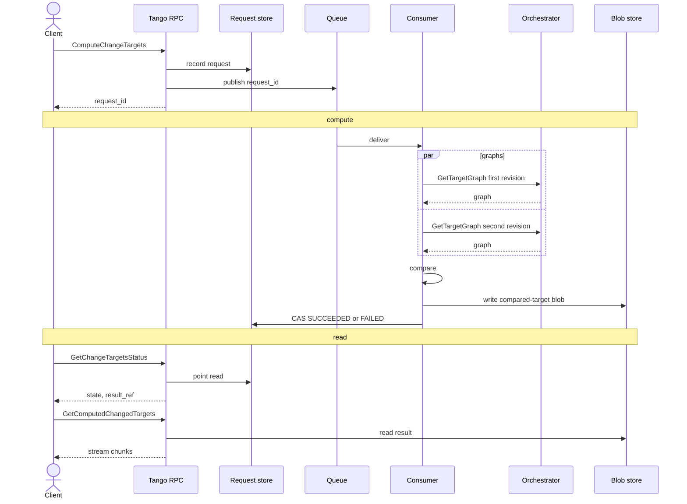

# Async Changed-Targets API

## Summary

`GetChangedTargets` holds a streaming RPC open while Bazel may run longer than the caller’s timeout. A disconnect aborts that work, and a retry repeats it because there is no durable handle to resume from. The result is already a content-addressed blob.

This RFC adds an asynchronous API: register work, return a `request_id`, compute independently of the caller, then read status and fetch the completed result. The synchronous RPC stays.

## Goals

- Decouple computation lifetime from RPC and client lifetime.
- Preserve the existing changed-target response stream and output filtering.


## Architecture

Three client RPCs. Compute writes the request, publishes `request_id`, and returns success only after the publish succeeds. Status and fetch are later reads that never start work.

The work consumer is blocking. It runs the same pipeline as today’s `GetChangedTargets` (two `GetTargetGraph` calls **in parallel**, then compare) and extends queue visibility until `Process` returns. There is no result-signal topic and no poll loop. A SubmitQueue build-signal split needs a pollable runner; native in-process Bazel is not that runner.




Large payloads stay in blob storage and queue messages stay small. Controller and consumer may co-locate or split.

## API Contract

Public surface is RPC, not the queue. Compute returns before Bazel. Status is unary metadata. Results stream from the blob. Cancel applies to that request.

```proto
rpc ComputeChangeTargets(ComputeChangeTargetsRequest) returns (ChangeTargetsCompute);
rpc GetChangeTargetsStatus(GetChangeTargetsStatusRequest) returns (ChangeTargetsStatus);
rpc GetComputedChangedTargets(GetComputedChangedTargetsRequest) returns (stream GetChangedTargetsResponse);
rpc CancelChangeTargets(CancelChangeTargetsRequest) returns (ChangeTargetsStatus);

message ComputeChangeTargetsRequest {
    GetChangedTargetsRequest computation = 1;
}

message ChangeTargetsCompute {
    string request_id = 1;
    ChangeTargetsStatus status = 2;
}

message GetChangeTargetsStatusRequest {
    string request_id = 1;
}

message GetComputedChangedTargetsRequest {
    string request_id = 1;
    OutputConfig output_config = 2;
}

message CancelChangeTargetsRequest {
    string request_id = 1;
}

message ChangeTargetsStatus {
    string request_id = 1;
    ComputeState state = 2;
    TangoError error = 3;
    string result_ref = 4;     // set when SUCCEEDED
    string download_url = 5;   // optional, short-lived; omitted unless enabled
}

enum ComputeState {
    COMPUTE_STATE_INVALID = 0;
    COMPUTE_STATE_PENDING = 1;
    COMPUTE_STATE_RUNNING = 2;
    COMPUTE_STATE_SUCCEEDED = 3;
    COMPUTE_STATE_FAILED = 4;
    COMPUTE_STATE_CANCELLED = 5;
}
```

- The RPC succeeds only after the request is stored **and** published. A failed publish is a failed RPC. A retry is a new store row, a new `request_id`, and a new publish. An orphan row from a failed publish is junk and is not repaired.
- Fetch before `SUCCEEDED` is a user error and does not start work. `OutputConfig` is send-time only. `download_url` is optional, short-lived, and omitted unless the deployment enables it. It is not required for v1 and must not be a long-lived URL on an enumerable id.
- Cancel CAS-marks the request `CANCELLED`. In-flight Bazel is not killed. The consumer must not overwrite `CANCELLED` with `SUCCEEDED` or `FAILED`. Status stays `CANCELLED`; fetch of that id is a user error. A cache blob may still appear from the race.


## Identity

One request is one unit of work. There is no shared in-flight computation.

- `request_id` is minted by Tango (`platform/extension/counter`) when the store row is written. Clients do not supply it. There is no `idempotency_key`. A client retry always creates new work. Counter ids are enumerable. Status and fetch are unauthenticated in this RFC; treat the API as internal. Tightening auth is out of scope.

Concurrent equivalent requests, and RPC retries, may run Bazel more than once. That matches today's sync path. The orchestrator still reads the result cache before computing.

## Persistence

Treat MySQL as a KV: point lookup, put-if-absent, compare-and-swap. No secondary indexes or queries over request values. Schema and key layout are implementation, not this RFC.

The store is kinded and payload-opaque so later async APIs reuse it. Status is a point read by `request_id`. There is no unpublished-accept outbox.

Write the compared-target blob, then CAS to `SUCCEEDED`. `Put` on the existing cache key is idempotent. Fetch of `SUCCEEDED` with a missing blob is infrastructure corruption, not a user miss.

## Handoff, queue, and consumer

Store, then publish, then return. The RPC succeeds only if publish succeeds. A failed publish fails the RPC; the store row is leftover junk and is not republished. A retry writes a new row and publishes again. If publish succeeds and the client never sees the response, the retry is a second request; the first may still run.

The work queue carries `request_id`. The consumer loads the request and, unless it is already terminal, claims `RUNNING` and runs the compare pipeline: two `GetTargetGraph` calls **in parallel** (two workspace leases, two Bazel queries) then compare, same as `GetChangedTargets`. There is no handle to a live native query on another replica, so `RUNNING` from a dead owner is not a reason to skip work.

While `Process` is alive, the consumer extends delivery visibility (cadence shorter than visibility) until it returns: both queries, compare, and blob write. Visibility is not a store claim other replicas honor. Budget is at least one query timeout plus compare, not two sequential timeouts. `RepoManager` still owns workspace capacity. Tenant is the configured repository.

If the request is already `SUCCEEDED`, `FAILED`, or `CANCELLED`, ack and do not start work (queue redelivery of the same `request_id`). `PENDING` or `RUNNING` (including after a crash) claims and runs the pipeline again. Duplicate in-flight Bazel is accepted. Result reuse is the existing content-addressed cache: a prior attempt that already wrote graphs or the compared-target blob is a cache hit, not a join onto the old process.

After a successful compare, write the blob then CAS status. First successful CAS wins; skip the CAS if the request is `CANCELLED`. `Put` on the cache key stays idempotent.

Ack terminals; nack retryable infra; persist then ack user errors; DLQ must mark `FAILED`.

## Request store

`core/storage/requeststore` follows blob storage: interface, memory backend, MySQL backend, selected in `example/main.go`. It is not another `Storage` implementation. Do not wrap SubmitQueue's `Queue`. One store serves every async API; changed-targets is the first kind plus its topic. The store contract includes insert, status, claim, terminal CAS, and cancel CAS.

## SubmitQueue platform

Reuse queue, consumer, pipeline, counter, and delivery. Do not take SubmitQueue domain types, topics, or `service/messagequeue`. Tango keeps `core/errors`; map retryable infra onto nack.

Two ways to get the packages:

1. Extract `github.com/uber/submitqueue-commons` and depend on that. Clean module graph; requires extraction and a SubmitQueue migration first.
2. Import `github.com/uber/submitqueue` `platform/` (and `api/base/messagequeue`) directly. Faster; Tango tracks SubmitQueue's cadence and module.

Tango owns one work stage and a DLQ reconciler. The counter mints `request_id` when the store row is created.

## Alternatives

**MySQL as the task queue.** Claiming `PENDING` rows needs a state query, which the KV constraint forbids, and reimplements leases, retries, and DLQ the platform already has.

**Queue-only public API.** Exposes private transport and still cannot carry large results.

**Stream results from status.** Status stays a small unary read.

**Accept-before-publish plus idempotency key.** Returning success on the store write lets retries reuse a request that never reached the queue, which needs a repairer. This RFC returns success only after publish and drops the idempotency key: a retry is a new request; an unpublished row is junk.

**Result-signal / build-signal poll.** Fits a remote `Trigger`/`Status` runner, not native in-process Bazel. Out of scope until such a runner exists.